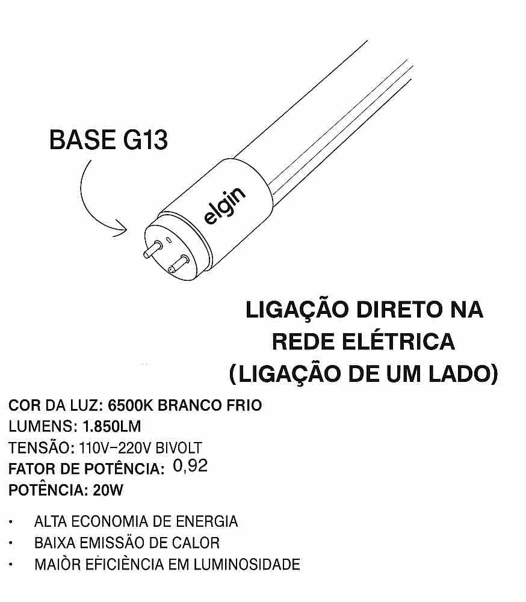
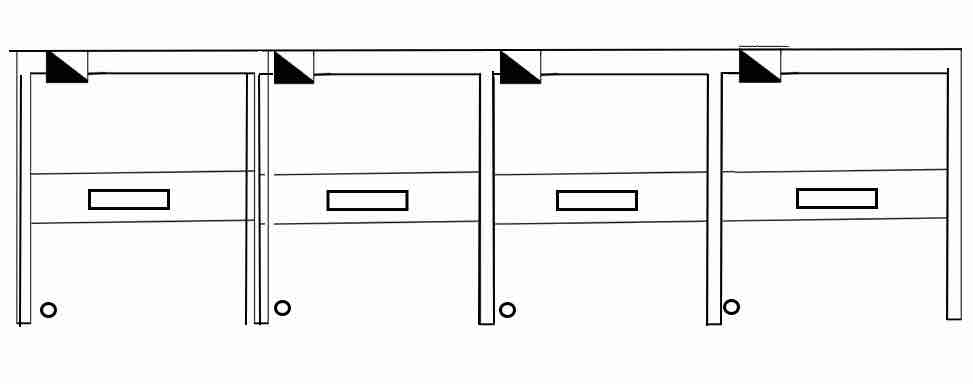

<td style="width: 10%;">
    
</td>

### **CENTRO FEDERAL DE EDUCAÇÃO TECNOLÓGICA DE MINAS GERAIS**  
### **Departamento de Engenharia Elétrica - CEFET-MG**  
### **Coordenação do Curso de Eletrotécnica**  

### Disciplina: **PLIEP - Prática de Laboratório de Instalações Elétricas Prediais**
### Guia de Aula – Instalação de Lâmpadas LED Tubulares em Circuito de Iluminação

---

##  Objetivos da Aula

Ao final desta atividade, o aluno será capaz de:

- Executar corretamente a ligação elétrica de **lâmpadas LED tubulares** em luminárias previamente adaptadas.  
- Compreender a diferença entre fluorescentes convencionais e LEDs tubulares com bypass de reator.  
- Representar graficamente a instalação em planta baixa.  
- Elaborar o diagrama unifilar correspondente ao circuito.  
- Realizar testes, medições e verificação do correto funcionamento das luminárias LED.  
- Aplicar normas e boas práticas de instalação e segurança.

---

##  Introdução

As lâmpadas LED tubulares substituem lâmpadas fluorescentes tradicionais, proporcionando maior eficiência energética, maior vida útil e menor manutenção.  

Ela  integra em sua estrutura um driver eletrônico interno, responsável pelo condicionamento e controle da energia elétrica, dispensando assim o uso de reatores ou outros dispositivos auxiliares externos. Sua instalação resulta em um sistema mais eficiente, compacto e confiável.

Para garantir o correto funcionamento e a segurança da instalação, devem ser respeitados os seguintes aspectos:

    * Polaridade correta dos terminais (quando aplicável ao modelo)
    
    * Tensões nominais de alimentação especificadas pelo fabricante
    
    * Aterramento adequado da carcaça metálica da luminária
    
    * Fixação mecânica firme e compatível com o ambiente de instalação

Existem dois tipos mais comuns de LED tubular:

- **Alimentação em uma ponta** → fase e neutro no mesmo lado.  
- **Alimentação em duas pontas** → fase de um lado e neutro do outro.

Para esta montagem, utilizaremos **alimentação em uma ponta**, o tipo mais comum nos laboratórios do CEFET-MG.

---

### Readequação da Luminária (Bypass do Reator)

Na substituição de lâmpadas fluorescentes por **lâmpadas LED tubulares**, torna-se indispensável a realização do **bypass do reator**, que consiste na **remoção elétrica total do reator da luminária**. Esse componente, utilizado exclusivamente em lâmpadas fluorescentes, é **incompatível com o funcionamento das lâmpadas LED** e, caso permaneça no circuito, pode provocar falhas, aquecimento excessivo ou danos permanentes ao equipamento.

Após a eliminação do reator, os **suportes (soquetes G13)** existentes na luminária podem ser **reaproveitados**, desde que estejam em boas condições mecânicas e elétricas. A alimentação elétrica deve ser realizada **diretamente nos terminais indicados pelo fabricante da lâmpada LED**, respeitando o tipo de ligação exigido (normalmente ligação de um lado – fase e neutro no mesmo extremo).

Essa readequação proporciona:

- Maior eficiência energética  
- Redução de perdas elétricas  
- Aumento da vida útil do conjunto  
- Maior segurança operacional  

**Passos gerais:**

1. **Desenergizar o circuito** (DTMG desligado).  
2. Remover reator e starter (quando houver).  
3. Interligar os condutores internos diretamente aos soquetes:  
   - **Fase → soquete A**  
   - **Neutro → soquete B**

**Características após adaptação:**

- Não utiliza reator, starter ou ignitor.  
- Requer ligação direta, conforme instrução do fabricante.  
- Deve receber tensão compatível (127 V nesta aula).

---

### Funcionamento da Lâmpada LED Tubular

A lâmpada LED tubular possui driver interno e não necessita de dispositivos auxiliares.  O circuito é simples e seguro, desde que respeitado:

- Polaridade dos terminais  
- Tensões nominais  
- Aterramento da carcaça metálica da luminária  
- Fixação mecânica adequada

---

### Comparação Rápida – Fluorescente x LED Tubular

| Característica | Fluorescente | LED Tubular |
|----------------|--------------|-------------|
| Usa reator? | Sim | Não |
| Pulsa na partida? | Sim | Não |
| Consumo agregado | Lâmpada + reator | Apenas lâmpada |
| Ligação | Complexa | Direta |
| Durabilidade | Média | Alta |

---

##  Estrutura Física dos Boxes

Cada box possui quatro superfícies principais:

- Parede de fundo : QDLF  
- Parede esquerda  : Interuptor de duas sessoões
- Teto :luminária para lampada tubular

Nesta aula, cada teto receberá **uma luminária tubular LED** devidamente adaptada e um interruptor de suas sessões para comandar as lâmpadas.

### Distribuição das montagens entre boxes (para fins didáticos)

- **Box 1:** Luminária com LED tubular 
- **Box 2:** Luminária com LED tubular 
- **Box 3:** Luminária com LED tubular 
- **Box 4:** Luminária com LED tubular 

---

##  Diagrama Unifilar - Desenho em Planta Baixa

### **Atividade 1 – Planejamento**

O aluno deve produzir o desenho simbólico indicando:

- Traçado dos eletrodutos  
- Posição das luminárias tubulares  
- Caixas de passagem necessárias  
- Trajeto dos condutores  
- Origem da alimentação (QDLF)

### **Elementos obrigatórios**

- Linhas contínuas/tracejadas  
- Símbolos das luminárias LED  
- Altura padrão dos comandos (1,20 m)
- Identificação de cada box

### **Instalação nas paredes (QDLF / Box individual)**

- 01 DTMG monopolar  
- Eletroduto vindo do QDLF → segundo ao ponto de comando
- Alimentação  para a luminária vinda do ponto de comando

## Características da Instalação

- Sistema monofásico  
- Tensão: **127 V**  
- Fiação: **1,5 mm²** (iluminação)  
- Condutores necessários:
  - **Fase**  
  - **Neutro**  
  - **Condutor de proteção (PE)** – aterramento da luminária

---

##  Execução da Instalação

### **a) Lançamento dos Condutores**

- Passar sonda pelos eletrodutos  
- Lançar neutro para cada luminária  
- Levar fase até os pontos de derivação  
- Distribuir ligações em paralelo conforme projeto  

⚠️ **Importante:**  
Cada luminária tubular deve receber **Retorno de fase do interruptor e neutro em um soquete**.

---

### **b) Conexões e Emendas**

- Emendar:

  - Luminária (neutro + fase direta)  
  - Derivações entre caixas  
  - Condutor de proteção na carcaça da luminária  

- Garantir:

  - Aperto firme  
  - Isolação adequada  
  - Identificação dos condutores  
  - Remoção total do reator

---

### **c) Testes e Energização**

- Solicitar inspeção do professor  
- Energizar o DTMG  
- Testar  as luminárias
- Verificar ausência de aquecimento anormal  
- Verificar firmeza dos soquetes G13 e aterramento

---

### **d) Desmontagem**

- Remover lâmpadas com cuidado  
- Preservar fios e conectores  
- Guardar cabos  
- Organizar o Box e limpar o ambiente  

---

